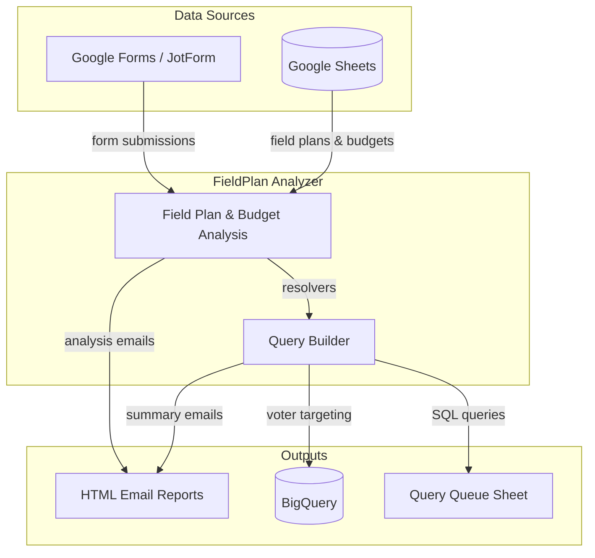

# Apps Script Field Coordination Tools

A monorepo of Google Apps Script applications used by Alabama Forward for field organizing coordination. The active project — **FieldPlan Analyzer** — turns Google Sheets into an automated system for field plan analysis, budget tracking, BigQuery voter targeting, and email reporting.

## Architecture Overview



## Project Structure

```
appsscript/
├── fieldplan_analyzer/          — Field plan & budget analysis system (active)
│   └── src/                     — 2026 cycle
│
├── field_coordination_browser/  — Deprecated: web-based precinct claiming
├── field_coordination_sheets/   — Deprecated: Sheets-native precinct claiming
├── field_quiz/                  — Deprecated: JotForm webhook → Mailchimp
│
├── docs/                        — Jekyll documentation site (GitHub Pages)
│
└── package.json                 — clasp dependency for deployment
```

## FieldPlan Analyzer (`fieldplan_analyzer/`)

Processes field plan and budget form submissions, analyzes them against programmatic standards, generates BigQuery voter targeting queries, and sends detailed HTML email reports to staff.

### Class Hierarchy

- `FieldPlan` — base class; parses a form row into organization info, contact details, geography, and demographics
- `FieldProgram` (extends `FieldPlan`) — adds volunteer hours, weekly attempts, and program length calculations
- `TacticProgram` (extends `FieldProgram`) — config-driven analysis for 7 tactic types (Phone Banking, Door Canvassing, Open Canvassing, Relational Organizing, Voter Registration, Text Banking, Mailers) with per-tactic APPROVE/REVIEW/NEEDS EDITS/REJECT badges
- `FieldBudget` — parses budget submissions; compares outreach vs. non-outreach spending; calculates expected outreach range with status flags

### Entry Points

- `processAllFieldPlans()` — time-based trigger to process new field plan submissions
- `analyzeBudgets()` — time-based trigger (every 12 hours) to analyze unprocessed budgets
- `checkForMissingFieldPlans()` — alerts when a budget exists without a matching field plan
- `buildQueriesForFieldPlan()` — generates BigQuery SQL queries for voter targeting based on field plan geography and demographics
- `onSpreadsheetEdit()` — reprocess trigger that detects checkbox edits on the REPROCESS column
- `generateWeeklySummary()` — Monday 9am summary of all field plan activity

### BigQuery Query Builder

Generates voter targeting SQL from field plan data:

1. **Resolvers** — resolve VAN IDs, race/age demographics, counties, and precincts from field plan inputs
2. **SQL Templates** — build exploration, county-targeting, precinct-list, metadata merge, and DWID select queries
3. **Queue Management** — writes queries to a `query_queue` sheet with pending/run/uploaded status tracking
4. **Executor** — runs queued queries against BigQuery and tracks results

### Source Files

**Infrastructure:** `_globals.js`, `_column_mappings.js`, `_query_config.js`

**Data models:** `field_plan_parent_class.js`, `field_program_extension_class.js`, `field_tactics_extension_class.js`, `budget_class.js`

**Triggers:** `field_trigger_functions.js`, `budget_trigger_functions.js`

**Query builder:** `query_builder.js`, `query_resolvers.js`, `query_sql_templates.js`, `query_executor.js`

**Presentation:** `email_builders.js`

**Tests:** `field_test_functions.js`, `budget_test_functions.js`, `query_test_functions.js`

### Deprecated Projects

The following projects are no longer in active development and remain in the repo for reference only:

- **Field Coordination Browser** (`field_coordination_browser/`) — web-based precinct claiming via Apps Script HtmlService
- **Field Coordination Sheets** (`field_coordination_sheets/`) — Sheets-native precinct claiming using `onEdit` triggers
- **Field Quiz** (`field_quiz/`) — JotForm webhook → Google Sheets → Mailchimp integration

## Getting Started

### Prerequisites

- Google account with access to the relevant Google Sheets
- [Node.js](https://nodejs.org/) (for clasp CLI)
- [clasp](https://github.com/google/clasp) — Google Apps Script CLI

### Setup

```bash
# Clone the repository
git clone https://github.com/alabama-forward/appsscript.git
cd appsscript

# Install clasp
npm install

# Log in to clasp
npx clasp login

# Push code to a specific project (each sub-project has its own .clasp.json)
cd fieldplan_analyzer
npx clasp push
```

Each sub-project contains a `.clasp.json` that maps it to a specific Apps Script project. Use `clasp push` from within the sub-project directory to deploy.

### Script Properties

Each Apps Script project requires script properties configured in the Apps Script editor (Project Settings > Script Properties). See [`SCRIPT_PROPERTIES_CONFIGURATION.md`](SCRIPT_PROPERTIES_CONFIGURATION.md) for the full list of required keys.

Key categories:
- **Sheet names** — which tabs to read/write (e.g., `SHEET_FIELD_PLAN`, `SHEET_FIELD_BUDGET`)
- **Email config** — recipient lists, reply-to addresses, test recipients
- **Cost targets** — per-tactic cost benchmarks and standard deviations
- **Trigger intervals** — how often time-based triggers run

## Configuration

All applications use `PropertiesService.getScriptProperties()` for environment-specific configuration. Column mappings are centralized in `_column_mappings.js` — when the spreadsheet structure changes, only that file needs updating.

## Documentation

Full documentation is published via GitHub Pages using Jekyll:

- [End Users](docs/end-users/) — how to use each application
- [Developers](docs/developers/) — technical guides and spreadsheet mappings
- [Troubleshooting](docs/troubleshooting.md) — common issues and solutions
- [FAQ](docs/faq.md) — frequently asked questions

Implementation guides for each analyzer version live in their respective `guides/` directories.

## Development

**Branch:** `main` — all development and production code lives on a single branch.

**Deployment:** Use `clasp push` from the `fieldplan_analyzer/` directory. The `.clasp.json` maps it to the Apps Script project.

**Testing:** Test functions (e.g., `testMostRecentFieldPlan()`) run in the Apps Script editor with `isTestMode = true`, routing emails to a test address with a `[TEST]` subject prefix. Tests never modify the ANALYZED column.
