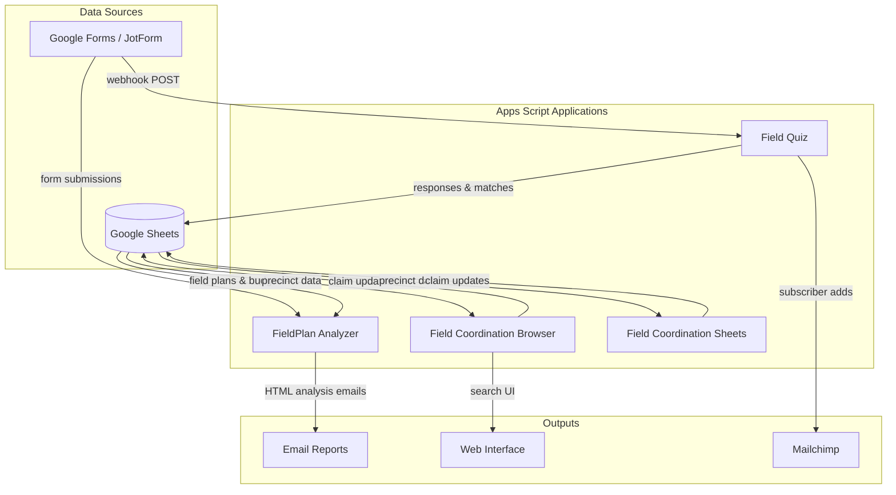

# Apps Script Field Coordination Tools

A monorepo of Google Apps Script applications used by Alabama Forward for field organizing coordination. These tools turn Google Sheets into automated systems for precinct claiming, field plan analysis, budget tracking, and volunteer matching.

## Architecture Overview



## Project Structure

```
appsscript/
├── fieldplan_analyzer/          — Field plan & budget analysis system
│   ├── 2025_analyzer/src/       — 2025 cycle (legacy)
│   └── 2026_analyzer/src/       — 2026 cycle (active development)
│
├── field_coordination_browser/  — Web-based precinct claiming app
│   ├── 2025v/src/               — 2025 cycle
│   └── 2026v/src/               — 2026 cycle
│
├── field_coordination_sheets/   — Sheets-native precinct claiming (no web UI)
│
├── field_quiz/src/              — JotForm webhook → Mailchimp integration
│
├── docs/                        — Jekyll documentation site (GitHub Pages)
│
└── package.json                 — clasp dependency for deployment
```

## Key Components

### FieldPlan Analyzer (`fieldplan_analyzer/`)

Processes field plan and budget form submissions, analyzes them against programmatic standards, and sends detailed HTML email reports to staff.

**Class hierarchy:**
- `FieldPlan` — base class; parses a form row into organization info, contact details, geography, and demographics
- `FieldProgram` (extends `FieldPlan`) — adds volunteer hours, weekly attempts, and program length calculations
- `TacticProgram` (extends `FieldProgram`) — config-driven analysis for 7 tactic types (Phone Banking, Door Canvassing, Open Canvassing, Relational Organizing, Voter Registration, Text Banking, Mailers)
- `FieldBudget` — parses budget submissions; compares outreach vs. non-outreach spending; flags missing data stipends

**Entry points:**
- Form submission triggers — process new field plans on submit
- `analyzeBudgets()` — time-based trigger (every 12 hours) to analyze unprocessed budgets
- `checkForMissingFieldPlans()` — alerts when a budget exists without a matching field plan

**Source files (2026):** `_globals.js`, `_column_mappings.js`, `field_plan_parent_class.js`, `field_program_extension_class.js`, `field_tactics_extension_class.js`, `budget_class.js`, `field_trigger_functions.js`, `budget_trigger_functions.js`, `email_builders.js`, `field_test_functions.js`, `budget_test_functions.js`

### Field Coordination Browser (`field_coordination_browser/`)

Web application that lets organizations search and claim precincts through an HTML interface served by Apps Script's HtmlService.

- **server-side.js** — `onOpen()` adds a custom menu; `onEdit()` watches dropdown selections in the search sheet and calls `claimItemForOrganization()` to update the priorities sheet
- **index.html / client-side.html** — search form (county, precinct name, precinct number) with dynamic results table
- **styles.html** — CSS styling

### Field Coordination Sheets (`field_coordination_sheets/`)

A simpler, container-bound version of precinct claiming that runs entirely within a Google Sheet (no separate web UI). Uses `onEdit` triggers to detect dropdown selections and record claims.

### Field Quiz (`field_quiz/`)

Receives JotForm webhook submissions via `doPost()`, matches respondents with organizations based on their interests and zip code, saves results to a Google Sheet, and adds subscribers to Mailchimp via API.

## Getting Started

### Prerequisites

- Google account with access to the relevant Google Sheets
- [Node.js](https://nodejs.org/) (for clasp CLI)
- [clasp](https://github.com/google/clasp) — Google Apps Script CLI

### Setup

```bash
# Clone the repository
git clone https://github.com/alabama-forward/appsscript.git
cd appsscript

# Install clasp
npm install

# Log in to clasp
npx clasp login

# Push code to a specific project (each sub-project has its own .clasp.json)
cd fieldplan_analyzer/2026_analyzer
npx clasp push
```

Each sub-project contains a `.clasp.json` that maps it to a specific Apps Script project. Use `clasp push` from within the sub-project directory to deploy.

### Script Properties

Each Apps Script project requires script properties configured in the Apps Script editor (Project Settings > Script Properties). See [`SCRIPT_PROPERTIES_CONFIGURATION.md`](SCRIPT_PROPERTIES_CONFIGURATION.md) for the full list of required keys.

Key categories:
- **Sheet names** — which tabs to read/write (e.g., `SHEET_FIELD_PLAN`, `SHEET_FIELD_BUDGET`)
- **Email config** — recipient lists, reply-to addresses, test recipients
- **Cost targets** — per-tactic cost benchmarks and standard deviations
- **Trigger intervals** — how often time-based triggers run

## Configuration

All applications use `PropertiesService.getScriptProperties()` for environment-specific configuration. Column mappings are centralized in `_column_mappings.js` — when the spreadsheet structure changes, only that file needs updating.

## Documentation

Full documentation is published via GitHub Pages using Jekyll:

- [End Users](docs/end-users/) — how to use each application
- [Developers](docs/developers/) — technical guides and spreadsheet mappings
- [Troubleshooting](docs/troubleshooting.md) — common issues and solutions
- [FAQ](docs/faq.md) — frequently asked questions

Implementation guides for each analyzer version live in their respective `guides/` directories.

## Development

**Branches:**
- `main` — stable production code
- `2026dev` — active development for the 2026 cycle
- `2026prod` — production deployment for 2026

**Deployment:** Use `clasp push` from the relevant sub-project directory. Each version (2025, 2026) deploys to its own Apps Script project.

**Testing:** Each analyzer includes test functions (e.g., `testMostRecentFieldPlan()`) that send output to `datateam@alforward.org` instead of production recipients.
