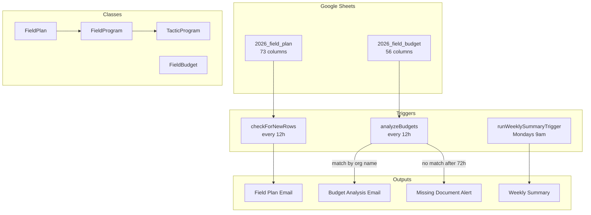

# 2026 FieldPlan Analyzer

Automated analysis system for Alabama Forward's 2026 field organizing cycle. Processes field plan and budget form submissions from Google Sheets, matches them by organization, calculates cost-per-attempt efficiency for each tactic, and sends detailed HTML email reports to staff.

## Architecture Overview



## Data Flow

1. An organization submits a **field plan** via JotForm; responses land in the `2026_field_plan` sheet
2. `checkForNewRows()` (every 12h) detects new rows, creates `FieldPlan` objects, and sends a field plan notification email
3. The organization also submits a **budget** form; responses land in the `2026_field_budget` sheet
4. `analyzeBudgets()` (every 12h) picks up unanalyzed budgets, matches each to a field plan by organization name, runs cost analysis per tactic, and sends a budget analysis email
5. If a budget or field plan goes unmatched for 72 hours, a missing-document alert email is sent

## Project Structure

```
2026_analyzer/
├── src/
│   ├── _globals.js                       — Script properties, getSpreadsheet(), getSheet()
│   ├── _column_mappings.js               — All column indices + validation utilities
│   ├── field_plan_parent_class.js        — FieldPlan base class (73 fields)
│   ├── field_program_extension_class.js  — FieldProgram (volunteer hours, attempts)
│   ├── field_tactics_extension_class.js  — TacticProgram + TACTIC_CONFIG (7 tactics)
│   ├── budget_class.js                   — FieldBudget class (budget line items)
│   ├── field_trigger_functions.js        — Field plan triggers, matching, tracking
│   ├── budget_trigger_functions.js       — Budget triggers, cost analysis, gap analysis
│   ├── email_builders.js                 — HTML email templates (Material Design)
│   ├── field_test_functions.js           — Field plan test suite
│   ├── budget_test_functions.js          — Budget test suite
│   └── appsscript.json                   — OAuth scopes and runtime config
├── guides/                               — Implementation and reference guides
└── .clasp.json                           — Maps to Apps Script project
```

## Key Components

### Class Hierarchy

```
FieldPlan                → parses a form row into contact, geography, demographics, confidence scores
  └─ FieldProgram        → adds programLength, weeklyVolunteers, weeklyHours, hourlyAttempts
       └─ TacticProgram  → config-driven; adds cost analysis via TACTIC_CONFIG
FieldBudget              → parses budget row; sums outreach vs. non-outreach; tracks analyzed status
```

### FieldPlan (`field_plan_parent_class.js`)

Base class constructed from a single spreadsheet row. Parses 73 columns covering:
- Contact info (org name, email, phone)
- Data & tools (VAN committee, data storage, program tools)
- Geography (counties, cities, precincts, special areas)
- Demographics (race, age, gender, affinity groups)
- Six confidence self-assessment scores (new in 2026)
- `needsCoaching()` — averages confidence scores and categorizes as High/Medium/Low need

Static factories: `fromLastRow()`, `fromFirstRow()`, `fromSpecificRow(rowNumber)`

### FieldProgram (`field_program_extension_class.js`)

Extends `FieldPlan` with per-tactic program metrics. Reads 4 fields from `PROGRAM_COLUMNS[tacticType]`:
- `programVolunteerHours()` — total volunteer hours across the program
- `programAttempts()` — total contact attempts (length x volunteers x hours x hourly rate)
- `weeklyAttempts()`, `weekVolunteerHours()`
- `attemptReasonableMessage(threshold, name)` — checks if hourly attempts are realistic
- `expectedContactsMessage(contactRange, name)` — projects successful contacts

### TacticProgram (`field_tactics_extension_class.js`)

Extends `FieldProgram`. Configured entirely via `TACTIC_CONFIG` — adding or modifying a tactic requires only editing the config object:

| Tactic | Cost Target | Std Dev | Contact Rate | Reasonable/hr |
|--------|------------|---------|--------------|---------------|
| Phone Banking | $0.66 | $0.15 | 5-10% | 30 |
| Door Canvassing | $1.00 | $0.20 | 5-10% | 30 |
| Open Canvassing | $0.40 | $0.10 | 10-15% | 40 |
| Relational | $0.50 | $0.15 | 20-30% | 50 |
| Voter Registration | $0.75 | $0.20 | 15-25% | 45 |
| Text Banking | $0.02 | $0.01 | 5-10% | 100 |
| Mailers | $0.50 | $0.15 | 100% | 1000 |

Key method: `analyzeCost(fundingAmount)` — returns cost-per-attempt, target bounds, and status (`below` / `within` / `above`).

### FieldBudget (`budget_class.js`)

Parses 56-column budget rows with requested/total/gap amounts for 15 line items (admin, data, travel, comms, design, video, print, postage, training, supplies, canvass, phone, text, event, digital).

- `sumOutreach()` / `sumNotOutreach()` — proportional spending breakdown
- `needDataStipend()` — calculates stipend hours at $20/hr
- `requestSummary()` — formatted HTML summary
- `markAsAnalyzed(rowNumber)` — writes `true` to the ANALYZED column
- Static: `getUnanalyzedBudgets()`, `countAnalyzed()`

### Column Mappings (`_column_mappings.js`)

Single source of truth for all column indices. Three mapping objects:
- `FIELD_PLAN_COLUMNS` — 35 keys, columns 0-72
- `BUDGET_COLUMNS` — 56 keys, columns 0-55
- `PROGRAM_COLUMNS` — 7 tactic groups x 4 metrics, columns 37-64

Includes `validateColumnMappings()` to check for duplicates and overlaps, and `COLUMN_QUESTIONS` mapping each column to its original form question text.

### Trigger Functions

**Field plan** (`field_trigger_functions.js`):
- `checkForNewRows()` — polls every 12h, processes new rows, sends emails, tracks missing budgets
- `getTacticInstances(rowData)` — creates `TacticProgram` for each tactic with data; reports incomplete submissions
- `findMatchingBudget(orgName)` — looks up budget by org name
- `onFieldPlanSubmission(fieldPlan)` — triggers budget analysis if a match exists

**Budget** (`budget_trigger_functions.js`):
- `analyzeBudgets()` — polls every 12h, processes unanalyzed budgets
- `processBudget(budgetData)` — matches to field plan, runs `analyzeBudgetWithFieldPlan()`, sends email, marks analyzed
- `analyzeTactic(budget, tactic)` — calculates cost-per-attempt against targets via `TACTIC_BUDGET_MAP`
- `analyzeGaps(budget, tactics)` — identifies funding gaps by category
- `generateWeeklySummary()` — weekly digest (Mondays at 9am)

### Email Builders (`email_builders.js`)

HTML email generator using Alabama Forward brand colors (navy `#363d4a`, rust `#b53d1a`). Two main email types:
- `buildFieldPlanEmailHTML(fieldPlan, tactics)` — sections for summary, stats, contact, program, narrative, geography, demographics, tactics, confidence
- `sendBudgetAnalysisEmail(budget, fieldPlan, analysis)` — cost analysis results per tactic with status indicators

Also: `sendMissingFieldPlanNotification()`, `sendMissingBudgetNotification()`, `sendErrorNotification()`

## Getting Started

### Prerequisites

- Google account with access to the 2026 Field Planning Form spreadsheet
- [clasp](https://github.com/google/clasp) CLI (`npm install` from the repo root)

### Deploy

```bash
cd fieldplan_analyzer/2026_analyzer
npx clasp push
```

### Initial Setup

1. In the Apps Script editor, run `setupScriptProperties()` once to initialize all script properties
2. Run `createSpreadsheetTrigger()` to create the field plan polling trigger
3. Run `createBudgetAnalysisTrigger()` to create the budget analysis trigger
4. Run `createWeeklySummaryTrigger()` to create the Monday summary trigger

## Configuration

All settings are stored as Apps Script **Script Properties** (Project Settings > Script Properties). The `setupScriptProperties()` function in `_globals.js` sets defaults:

| Property | Default | Purpose |
|----------|---------|---------|
| `SPREADSHEET_ID` | *(set in code)* | Target Google Sheet |
| `SHEET_FIELD_PLAN` | `2026_field_plan` | Field plan tab name |
| `SHEET_FIELD_BUDGET` | `2026_field_budget` | Budget tab name |
| `EMAIL_RECIPIENTS` | *(set in script properties)* | Production email list |
| `EMAIL_TEST_RECIPIENTS` | *(set in script properties)* | Test mode email |
| `EMAIL_REPLY_TO` | *(set in script properties)* | Reply-to address |
| `TRIGGER_BUDGET_ANALYSIS_HOURS` | `12` | Budget analysis interval |
| `TRIGGER_FIELD_PLAN_CHECK_HOURS` | `12` | Field plan check interval |
| `TRIGGER_MISSING_PLAN_THRESHOLD_HOURS` | `72` | Hours before missing-doc alert |
| `TRIGGER_WEEKLY_SUMMARY_DAY` | `MONDAY` | Weekly summary day |
| `TRIGGER_WEEKLY_SUMMARY_HOUR` | `9` | Weekly summary hour (ET) |

## Testing

Test functions send emails to the configured test recipient with a `[TEST]` subject prefix. They never modify the ANALYZED column.

**Field plan tests** (`field_test_functions.js`):
- `testMostRecentFieldPlan()` — sends test email for the latest field plan

**Budget tests** (`budget_test_functions.js`):
- `testBudgetClass()` — validates all FieldBudget methods
- `testFindMatching()` — tests organization name matching
- `testAnalyzeOrg()` — runs full analysis pipeline in test mode

**Manual functions**:
- `analyzeSpecificOrganization(orgName, isTestMode)` — analyze one org on demand
- `reprocessAllAnalyses(isTestMode)` — rerun all field plans and budgets

## Guides

- [Implementation Guide](guides/implementation_guide_corrected.md) — full build walkthrough
- [2025 to 2026 Updates](guides/2025_to_2026_updates.md) — what changed between cycles
- [Column Mapping Guide](guides/column_mapping_guide.md) — spreadsheet structure reference
- [Email Design Guide](guides/email_design_guide.md) — email template patterns
- [Clasp Deployment Guide](guides/clasp_deployment_guide.md) — deploying and versioning with clasp
- [Local Testing Guide](guides/local_testing_guide.md) — running tests locally with service accounts
- [TypeScript Migration Guide](guides/typescript_migration_guide.md) — future migration plan
